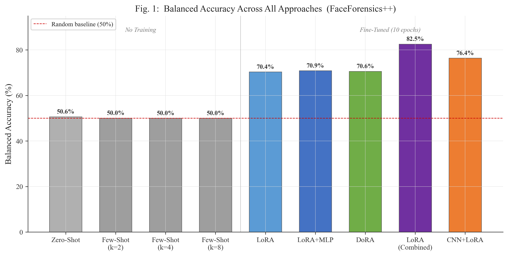
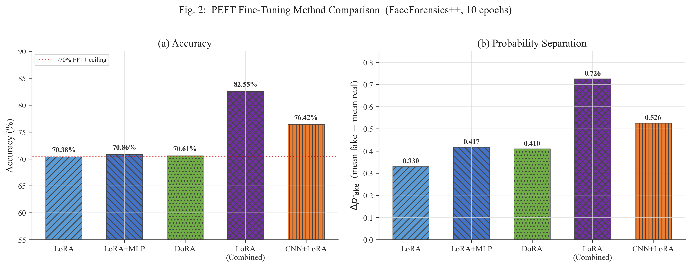
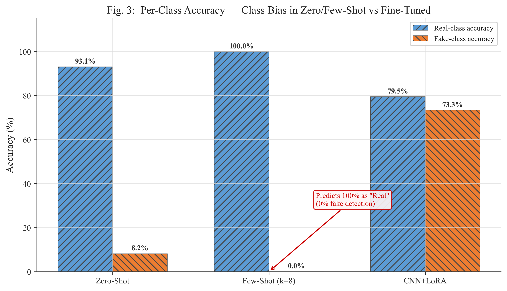
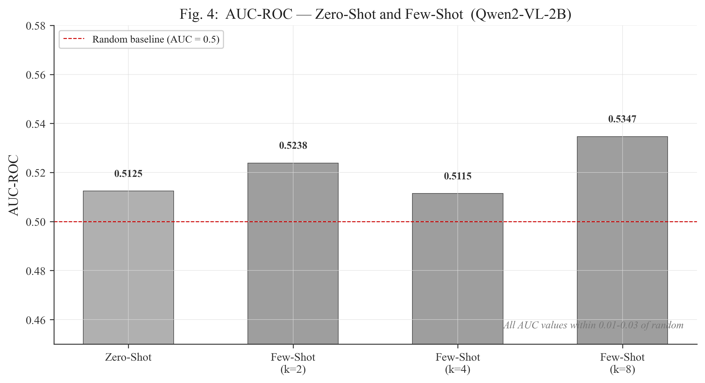
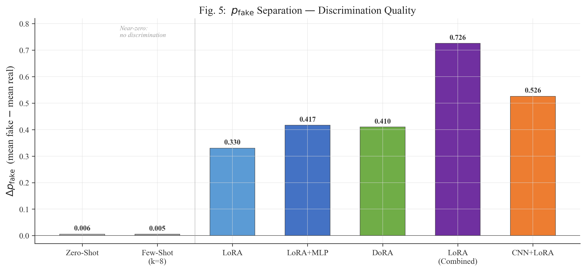
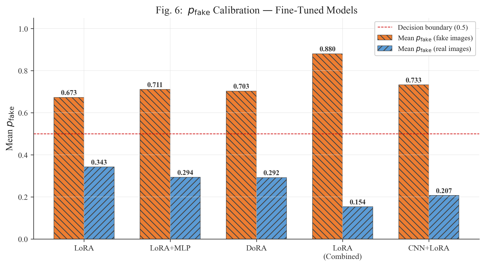
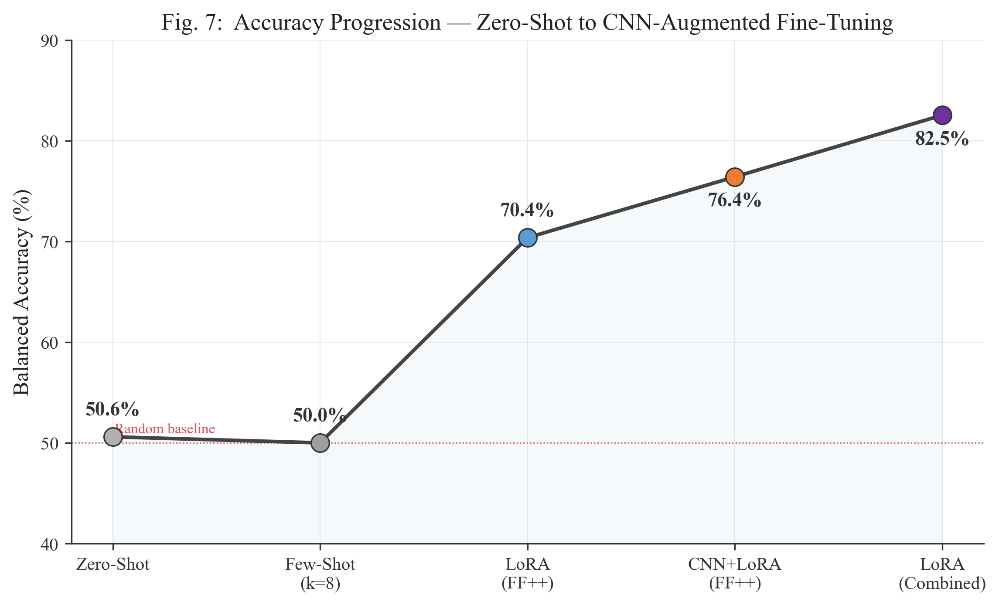
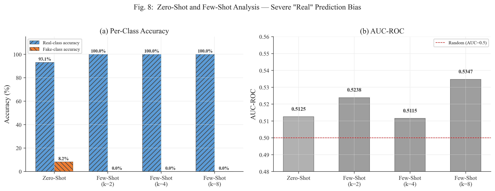

# FAKESHEILD: Deepfake Detection with Vision-Language Models

## Experimental Results & Analysis

---

## Abstract

This study evaluates the deepfake detection capability of Qwen2-VL-2B-Instruct across zero-shot, few-shot, LoRA fine-tuning, and a novel CNN+PEFT hybrid architecture on FaceForensics++ (c23) and CelebDF. Pre-trained VLMs exhibit no forensic capability (balanced accuracy ≈ 50%). Fine-tuning with LoRA achieves 70.4%, CNN+LoRA reaches 76.4%, and combined-dataset training attains 82.6%. These results establish that VLM-based deepfake detection requires explicit task adaptation.

---

## 1. Experimental Setup

**Model:** Qwen2-VL-2B-Instruct | **Datasets:** FaceForensics++ (c23), CelebDF | **Metric:** Balanced accuracy, p_fake separation (Δp_fake)

**Evaluation:** Forced-choice scoring via p_fake = σ(log P("Fake") − log P("Real")), yielding calibrated probabilities. Separation Δp_fake = E[p_fake|fake] − E[p_fake|real] quantifies discrimination quality (1.0 = perfect, 0.0 = random).

---

## 2. Results & Analysis

### 2.1 Balanced Accuracy Across All Approaches

All zero-shot and few-shot conditions achieve balanced accuracy of 50.0–50.6%, statistically equivalent to random. Fine-tuning produces a phase transition: LoRA reaches 70.4%, CNN+LoRA 76.4%, and combined-dataset LoRA 82.6%. This confirms that deepfake detection is an acquired capability, not an emergent property of VLM pre-training.

---

### 2.2 PEFT Method Comparison

| Method | Accuracy | Δp_fake | Dataset |
|--------|:--------:|:-------:|:-------:|
| LoRA | 70.38% | 0.330 | FF++ |
| LoRA+MLP | 70.86% | 0.417 | FF++ |
| DoRA | 70.61% | 0.410 | FF++ |
| CNN+LoRA | 76.42% | 0.526 | FF++ |
| LoRA (Combined) | **82.55%** | **0.726** | FF++ + CelebDF |

Single-dataset PEFT methods converge near a ~70% ceiling regardless of adapter architecture. CNN+LoRA exceeds this by +6% through forensic feature injection; combined-dataset training yields a further +6% through improved generalization. Separation scores reveal that LoRA+MLP and DoRA produce better-calibrated confidences than vanilla LoRA despite similar accuracy.

---

### 2.3 Per-Class Accuracy — Prediction Bias

Zero-shot achieves 93.1% real-class accuracy but only 8.2% fake-class accuracy. Few-shot (k=8) degenerates to a constant "Real" predictor (100% / 0.0%). This reflects the VLM's pre-training calibration to human-level perception — deepfakes appear genuine at the macro level. CNN+LoRA resolves this bias, achieving balanced per-class performance (79.5% real, 73.3% fake).

---

### 2.4 AUC-ROC — Zero-Shot & Few-Shot

All zero/few-shot AUC values lie within 0.01–0.035 of random (0.5), confirming that the failure is not a threshold selection issue. No discriminative ranking signal exists in the pre-trained model's representations, regardless of prompt configuration.

---

### 2.5 Discrimination Quality (p_fake Separation)

Fine-tuning transforms discrimination quality by a factor of 60× (Δp_fake: 0.006 → 0.330 for LoRA). CNN+LoRA further improves to 0.526 through forensic feature injection, while combined-dataset training achieves 0.726. The near-zero separation in zero/few-shot conditions confirms the absence of any latent forensic signal.

---

### 2.6 Probability Calibration

All fine-tuned models exhibit correct calibration (mean p_fake above 0.5 for fakes, below for reals). Combined-dataset LoRA achieves near-ideal performance (0.880 / 0.154), placing most predictions far from the decision boundary. CNN+LoRA produces the strongest single-dataset real-class calibration (mean_real = 0.207), indicating forensic features are particularly effective for authenticity confirmation.

---

### 2.7 Accuracy Progression

The progression from 50% → 70.4% → 76.4% → 82.6% reveals three distinct performance regimes: (1) random-level without training, (2) dataset-specific learning via LoRA with architectural augmentation, (3) generalization through data diversity. Diminishing marginal returns suggest that 90%+ accuracy requires stronger forensic backbones or uncompressed source data.

---

### 2.8 Few-Shot Failure Analysis

Increasing the number of few-shot exemplars is counterproductive: fake-class accuracy drops from 8.2% (zero-shot) to 0.0% (k≥2). Textual descriptions of forensic cues reinforce the majority-class prior without providing actionable visual guidance. AUC remains near 0.5 across all k, confirming no ranking improvement.

---

## 3. Conclusions

1. Pre-trained VLMs exhibit **no inherent deepfake detection capability** (balanced accuracy ≈ 50%)
2. LoRA fine-tuning is **necessary and sufficient** to achieve 70%+ accuracy
3. CNN forensic feature injection provides a **+6% architectural gain**
4. Training data diversity yields the **largest single improvement** (+12%)
5. Without fine-tuning, VLMs exhibit **severe "Real" prediction bias** (92–100% of predictions)

---

## Appendix: Complete Results

| Method | Bal. Acc | AUC | Δp_fake | p_fake (F) | p_fake (R) | Real Acc | Fake Acc |
|--------|:-------:|:---:|:------:|:---------:|:---------:|:-------:|:-------:|
| Zero-Shot | 50.6% | 0.513 | 0.006 | 0.332 | 0.326 | 93.1% | 8.2% |
| Few-Shot k=2 | 50.0% | 0.524 | 0.005 | 0.256 | 0.251 | 100% | 0.0% |
| Few-Shot k=4 | 50.0% | 0.512 | 0.002 | 0.227 | 0.225 | 100% | 0.0% |
| Few-Shot k=8 | 50.0% | 0.535 | 0.005 | 0.252 | 0.247 | 100% | 0.0% |
| LoRA | 70.4% | — | 0.330 | 0.673 | 0.343 | — | — |
| LoRA+MLP | 70.9% | — | 0.417 | 0.711 | 0.294 | — | — |
| DoRA | 70.6% | — | 0.410 | 0.703 | 0.292 | — | — |
| CNN+LoRA | 76.4% | — | 0.526 | 0.733 | 0.207 | 79.5% | 73.3% |
| LoRA (Combined) | 82.6% | — | 0.726 | 0.880 | 0.154 | — | — |
